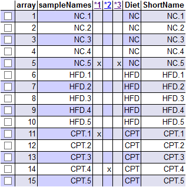
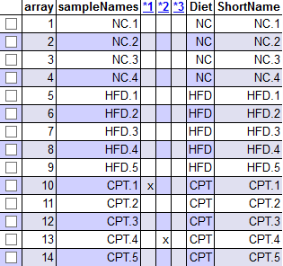
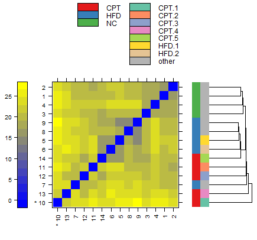
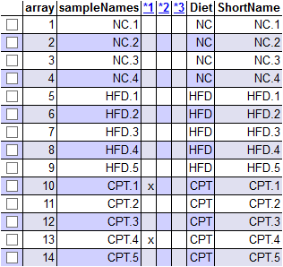
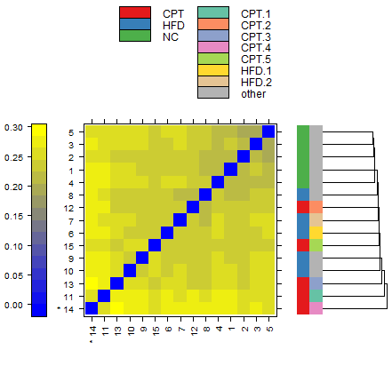

```{r setup, include=FALSE}
knitr::opts_chunk$set(echo = FALSE)
```


### Enllaç al repositori GIT associat a la PAC: https://github.com/onualart/liver.git


### Títol de l'estudi: Expression data from liver of Cyclocarya paliurus triterpenic acids treated high-fat-diet-induced mice

### Identificador GEO de l'estudi: GSE125045

### Enllaç a GEO: https://www.ncbi.nlm.nih.gov/geo/query/acc.cgi?acc=GSE125045

### Organisme: *Mus musculus*

### Tipus d'array: Affymetrix Mouse Gene 2.0 ST Array

### Identificador GEO de l'array: GPL16570 	


## ÍNDEX


## 1. Abstract.

Es sap que els àcids triterpenics de la planta *Cyclocarya paliurus* (ATCP) tenen efectes beneficiosos en pacients amb esteatosi hepàtica no alcohòlica (EHNA), paliant l'estrès oxidatiu i la disfunció mitocondrial associats a aquesta malaltia. Aquest estudi utilitza microarrays per estudiar, en teixit hepàtic d'un model de ratolí, l'expressió gènica subjacent als símptomes de l'EHNA i al tractament amb ATCP.


## 2. Objectius.

Tot i que la informació que podem obtenir a partir de la pàgina de GEO no especifica els objectius concrets (l'estudi no està publicat), podem marcar-ne uns de lògics.

- Identificar gens que s'expressen diferencialment entre els grups de ratolins estudiats.
  + Per ampliar el coneixement general de la malaltia, al comparar grups de ratolins no tractats.
  + Per estudiar l'efecte del tractament amb ATCP, al comparar ratolins sense tractament amb ratolins tractats.

- A partir d'aquests gens expressats diferencialment, identificar processos i "pathways" alterats en aquestes comparacions, i veure quina relació poden tenir, ja sigui directa o indirectament, amb l'estrès oxidatiu i la disfunció mitocondrial que, en principi, es veuen afectats pel tractament amb ATCP.


## 3. Materials i mètodes.

###     3.1. Disseny de l'experiment.

D'acord amb la informació disponible, 15 ratolins van ser repartits aleatoriament en tres grups (5 per grup) corresponents als tres nivells d'un factor:

- Grup de control normal (grup NC): va rebre una dieta estàndard.

- Grup de dieta alta en greixos (grup HFD): va rebre una dieta alta en greixos (sals biliars sodiques 0.5%, colesterol 2%, rovell d'ou 10%, llard 10%, dieta estàndard 77.5%; aproximadament 4016 kcal/kg, 30% de calories de greix).

- Grup tractat amb ATCP (grup CPT): va ser administrat amb ATCP (160 mg/kg) diàriament durant 8 setmanes després de rebre la dieta alta en greixos durant 12 setmanes.

Convé notar que l'experiment s'hauria pogut plantejar de forma diferent: es podrien haver creat dos factors, la dieta i el tractament, cada un amb dos nivells (dieta estàndard / alta en greixos, i tractament / absència de tractament). És de suposar que es descartés el grup de dieta estàndard amb tractament per irrellevant, tot i que crec que hauria pogut ser útil per estudiar la interacció entre els dos factors.


Després d'haver rebut la dieta i tractament corresponents al seu grup durant el període establert, els ratolins van ser sacrificats i se'n van extreure mostres de fetge per ser analitzades.

Els microarrays utilitzats per fer l'anàlisi són del model Affymetrix Mouse Gene 2.0 ST Array (GPL16570). Es tracta d'arrays d'oligonucleòtids d'un color, amb sondes corresponents a fragments d'una selecció de gens de ratolí.


###     3.2. Procediment d'anàlisi de les dades.

El procediment detallat amb tot el codi de R utilitzat, juntament amb l'*output* dels fragments de codi, es pot trobar a l'arxiu "pipeline.pdf" al repositori de GitHub, generat a partir de l'arxiu de markdown "pipeline.Rmd".


####        3.2.1. Preparació de les dades.

Abans que res, el primer que hem fet és descarregar els arxius .CEL de la pàgina de GEO i preparar l'arxiu *targets*. Aquests arxius els hem posat al subdirectori *data* del repositori.

A l'arxiu *targets* hem organitzat les dades, d'acord amb el disseny experimental descrit, en un factor (Diet) amb tres nivells (NC, HFD i CPT). Les 15 mostres les hem assignat als diferents nivells d'acord amb la informació disponible.

A partir d'aquí hem utilitzat R per fer el tractament de les dades.

Hem carregat l'arxiu *targets*, i la informació dels arxius .CEL l'hem passat a l'*ExpressionSet* *rawData*.


####       3.2.2. Control de qualitat de les dades crues.

Per fer el control de qualitat de les dades crues hem utilitzat el paquet *arrayQualityMetrics*, que genera un informe molt complet.


```{r pressure, echo=FALSE, fig.cap="A caption", out.width = '100%'}

```


Al resum del control de qualitat comprovem que es detecten alguns *outliers*, especialment a la mostra NC.5.


```{r pressure, echo=FALSE, fig.cap="A caption", out.width = '100%'}
knitr::include_graphics("arrayQualityMetrics report for rawData/hm.png")
```


Al *heatmap*, per exemple, es veu clarament que aquesta mostra (corresponent a la primera columna/última fila) es diferencia de la resta.

Tenint en compte que es tracta d'una mostra del grup control, del qual no esperariem grans variacions, optem per no utilitzar aquesta mostra en els anàlisis.

Un cop tretes les dades de la mostra, repetim el control de qualitat.

```{r pressure, echo=FALSE, fig.cap="A caption", out.width = '100%'}

```

Observem que ara no hi ha cap mostra amb més d'un marcador d'*outliers*.

```{r pressure, echo=FALSE, fig.cap="A caption", out.width = '100%'}

```

El *heatmap* és ara més uniforme, només la mostra CPT.1 és detectada com a *outlier* però no es visualitza una diferència tan destacada.


####      3.2.3. Normalització.

Utilitzem el mètode Robust Multichip Analysis per fer la normalització. Aquest mètode, fàcil d'aplicar amb R mitjançant la funció *rma* del paquet *oligo*, engloba tots els passos de la correcció del soroll de fons, la normalització en sí i la sumaritzarització de les dades.

Un cop realitzat el procés, les dades queden guardades a *normData*, un *ExpressionSet* força més reduit, ja que els valors de les sondes individuals s'han "sumaritzat" en un sol valor per "gen" (*probeset*). 


####      3.2.4. Control de qualitat de les dades normalitzades.

Repetim el control de qualitat que hem fet amb el paquet "arrayQualityMetrics", aquesta vegada sobre les dades normalitzades i sumaritzades.

```{r pressure, echo=FALSE, fig.cap="A caption", out.width = '100%'}

```


En aquest cas detectem només *outliers* en les distàncies entre arrays. Al no haver-hi cap mostra amb més d'un marcador, donem per bones totes les mostres.


```{r pressure, echo=FALSE, fig.cap="A caption", out.width = '100%'}

```

Al *heatmap*, efectivament, observem diferència entre les mostres marcades com a *outliers* (la primera fila / última columna) i la resta, però no sembla una diferència especialment gran.


####      3.2.5. Filtratge no específic.

Per filtrar els gens menys variables del nostre *ExpressionSet*, apliquem la funció *nsFilter* del paquet *genefilter.

En aquest cas el llindar de variabilitat que hem posat és baix, de 0,5, ja que hem optat per ser conservadors amb les dades. Això vol dir que dels gens del nostre conjunt de dades que podriem utilitzar per fer els anàlisis, ens quedem amb la meitat que mostra major variabilitat i descartem l'altra meitat.

El paquet *mogene20sttranscriptcluster.db*, que conté anotacions corresponents als gens de l'array, ens proporciona els identificadors dels gens, cosa que ens permet deixar fora també els gens que no tinguin identificador.

Aquests són els gens eliminats en el procés de filtratge:


```{r, echo=FALSE}
print(filtered$filter.log)
```


Guardem les dades normalitzades i les dades filtrades en arxius a la carpeta *results* del repositori.


####      3.2.6. Identificació de gens diferencialment expressats.

Per identificar els gens diferencialment expressats, primer hem de crear les matrius de disseny i de contrastos.

La funció *model.matrix* del paquet *limma* ens genera fàcilment la matriu de disseny a partir de les nostres dades.

```{r, echo = FALSE}
library(limma)
designMat<- model.matrix(~0+Diet, pData(filtData))
colnames(designMat) <- c("CPT", "HFD", "NC")
print(designMat)
```


De cara a decidir quins contrastos farem per analitzar les dades, ens centrarem en els objectius que hem marcat.

El contrast que pot ser més rellevant és entre el grup de dieta alta en greixos (HFD) i el grup de tractament (CPT), ja que és el que ens dóna informació directa sobre l'efecte del tractament.

El contrast entre el grup de dieta estàndard (NC) i el grup de dieta alta en greixos (HFD) no ens diu res sobre l'efecte del tractament, però sí que ens aporta informació sobre l'alteració de base.

El tercer contrast possible, entre el grup de dieta estàndard (NC) i el grup de dieta alta en greixos i amb tractament (CPT), en principi és el menys rellevant ja que, malgrat que els dos grups els hem posat en un mateix factor, en realitat ens està donant informació conjunta de dos factors diferents: la dieta i el tractament. Tot i que  analitzar dos factors conjuntament no ens dona per sí sol informació útil, sí que ens pot ajudar a entendre la interacció entre els dos factors, de manera que aquesta comparació també la inclourem a l'anàlisi.

Amb els contrastos decidits, generem la matriu amb la funció *makeContrasts* del paquet *limma*.

```{r, echo = FALSE}
contMat <- makeContrasts (NCvsCPT = CPT-NC,
                          HFDvsCPT = CPT-HFD,
                          NCvsHFD = HFD-NC,
                          levels=designMat)
print(contMat)
```


Estimem el model amb la funció *lmFit* del paquet *limma*. En cada grup definit a la matriu de disseny, calculem el model per cada gen a partir dels valors d'expressió de les diferents mostres del grup. 


Tot seguit regularitzem la variança amb la funció *eBayes* i guardem els resultats en un arxiu.


