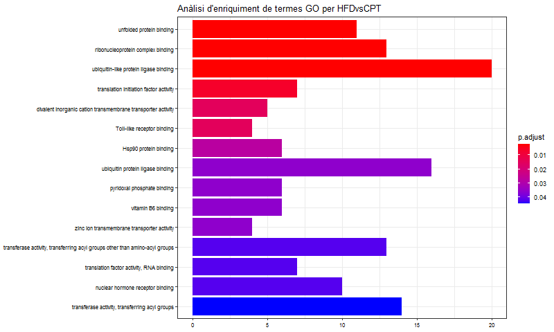
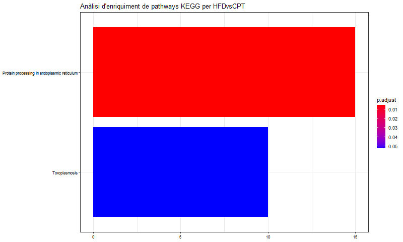
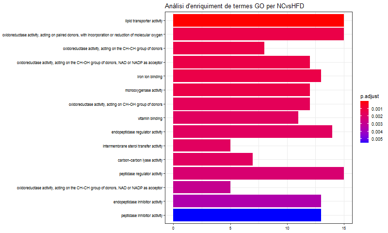
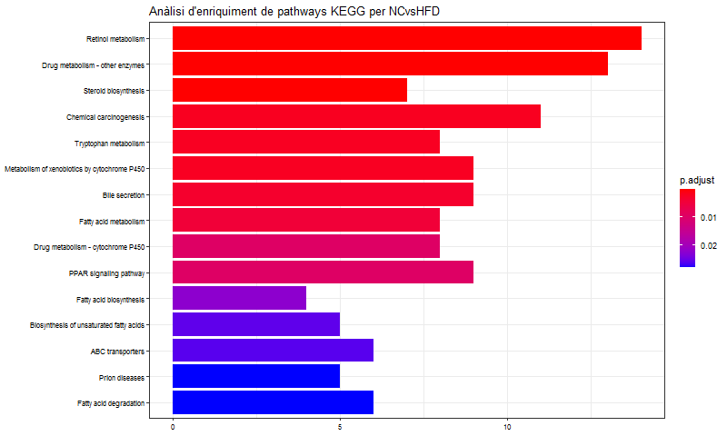
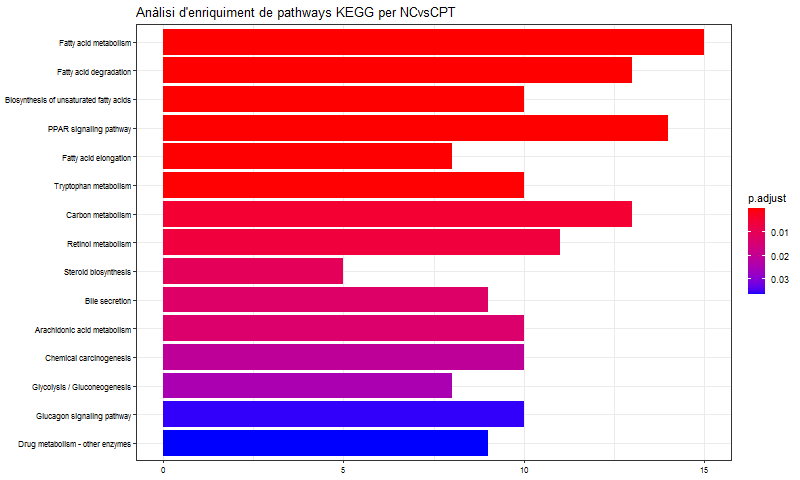

```{r setup, include=FALSE}
knitr::opts_chunk$set(echo = FALSE)
```


#### Enllaç al repositori de GitHub associat a la PAC: <https://github.com/onualart/liver.git>


#### Títol de l'estudi: Expression data from liver of *Cyclocarya paliurus* triterpenic acids treated high-fat-diet-induced mice [@1] (GSE125045)

***	

## CONTINGUTS

* **[1. Abstract](#abstract)**
* **[2. Objectius](#objectius)**
* **[3. Materials i mètodes](#materials-i-mètodes)**  
    + **[3.1. Disseny de l'experiment](#disseny-de-lexperiment)**
    + **[3.2. Procediment d'anàlisi de les dades](#procediment-danàlisi-de-les-dades)**  
        - **[3.2.1. Preparació de les dades](#preparació-de-les-dades)**
        - **[3.2.2. Control de qualitat de les dades crues](#control-de-qualitat-de-les-dades-crues)**
        - **[3.2.3. Normalització](#normalització)**
        - **[3.2.4. Control de qualitat de les dades normalitzades](#control-de-qualitat-de-les-dades-normalitzades)**
        - **[3.2.5. Filtratge no específic](#filtratge-no-específic)**
        - **[3.2.6. Identificació de gens diferencialment expressats](#identificació-de-gens-diferencialment-expressats)**
        - **[3.2.7. Anotació dels resultats](#anotació-dels-resultats)**
        - **[3.2.8. Comparació entre comparacions](#comparació-entre-comparacions)**
        - **[3.2.9. Anàlisi de significació biològica](#anàlisi-de-significació-biològica)**
* **[4. Resultats](#resultats)**
* **[5. Discussió](#discussió)**
* **[Referencies](#referencies)**

***

\newpage

## 1. Abstract

Es sap que els àcids triterpenics de la planta *Cyclocarya paliurus* (ATCP) tenen efectes beneficiosos en pacients amb esteatosi hepàtica no alcohòlica (EHNA), paliant l'estrès oxidatiu i la disfunció mitocondrial associats a aquesta malaltia. Aquest estudi utilitza microarrays per estudiar, en teixit hepàtic d'un model de ratolí, l'expressió gènica subjacent als símptomes de l'EHNA i al tractament amb ATCP.

***

## 2. Objectius

Tot i que la informació que podem obtenir a partir de la pàgina de GEO no especifica els objectius concrets (l'estudi no està publicat), sabem que és un experiment de tipus "perfil d'expressió". Podem marcar uns objectius lògics.

- Identificar gens que s'expressen diferencialment entre els grups de ratolins estudiats.
  + Per ampliar el coneixement general dels processos subjacents als símptomes de la malaltia, al comparar grups de ratolins no tractats.
  + Per estudiar l'efecte del tractament amb ATCP, al comparar ratolins sense tractament amb ratolins tractats.

- A partir d'aquests gens expressats diferencialment, identificar processos i *pathways* alterats en aquestes comparacions, i veure quina relació poden tenir, ja sigui directa o indirectament, amb els coneixements previs que tenim de la malaltia i del tractament.

***

## 3. Materials i mètodes

###     3.1. Disseny de l'experiment

D'acord amb la informació disponible, 15 ratolins van ser repartits aleatoriament en tres grups (5 per grup) corresponents als tres nivells d'un factor:

- Grup de control normal (grup NC): va rebre una dieta estàndard.

- Grup de dieta alta en greixos (grup HFD): va rebre una dieta alta en greixos (sals biliars sodiques 0.5%, colesterol 2%, rovell d'ou 10%, llard 10%, dieta estàndard 77.5%; aproximadament 4016 kcal/kg, 30% de calories de greix).

- Grup tractat amb ATCP (grup CPT): va ser administrat amb ATCP (160 mg/kg) diàriament durant 8 setmanes després de rebre la dieta alta en greixos durant 12 setmanes.

Els ratolins van ser sacrificats i se'n van extreure mostres de fetge per ser analitzades.

Els microarrays utilitzats per fer l'anàlisi són del model Affymetrix Mouse Gene 2.0 ST Array (GPL16570). Es tracta d'arrays d'oligonucleòtids d'un color, amb sondes corresponents a fragments d'una selecció de gens de ratolí.


###     3.2. Procediment d'anàlisi de les dades

El procediment detallat amb tot el codi de R utilitzat, juntament amb l'*output* dels fragments de codi, es pot trobar a l'arxiu "pipeline.pdf" al repositori de GitHub, generat a partir de l'arxiu de markdown "pipeline.Rmd". El codi pressuposa tenir instal·lats tots els paquets de R necessaris, inclosos els paquets d'anotacions *mogene20sttranscriptcluster.db* i *org.Mm.eg.db*.

El codi utilitzat està basat principalment en el que apareix al *Case Study 1* dels materials de l'assignatura (<https://github.com/ASPteaching/Omics_Data_Analysis-Case_Study_1-Microarrays>).


###        3.2.1. Preparació de les dades

Abans que res, el primer que hem fet és descarregar els arxius .CEL de la pàgina de [GEO](https://www.ncbi.nlm.nih.gov/geo/query/acc.cgi?acc=GSE125045) i preparar l'arxiu *targets*. Aquests arxius els hem posat al subdirectori *data* del repositori.

A l'arxiu *targets* hem organitzat les dades, d'acord amb el disseny experimental descrit, en un factor (*Diet*) amb tres nivells (NC, HFD i CPT). Les 15 mostres les hem assignat als diferents nivells d'acord amb la informació disponible.

A partir d'aquí hem utilitzat R per fer el tractament de les dades.

Primer hem carregat l'arxiu *targets*, i la informació dels arxius .CEL l'hem passat a l'objecte *rawData*.

```{r, include=FALSE}
targets <- read.csv2("./data/targets.csv", header = TRUE, sep = ";")
```


```{r, include=FALSE}
library(oligo)
celFiles <- list.celfiles("./data", full.names = TRUE)
library(Biobase)
my.targets <-read.AnnotatedDataFrame(file.path("./data","targets.csv"),
                                     header = TRUE, row.names = 1, 
                                     sep=";") 
rawData <- read.celfiles(celFiles, phenoData = my.targets)
```


```{r, include=FALSE}
my.targets@data$ShortName->rownames(pData(rawData))
colnames(rawData) <-rownames(pData(rawData))
```


###       3.2.2. Control de qualitat de les dades crues

Per fer el control de qualitat de les dades crues hem aplicat la funció *arrayQualityMetrics* del paquet amb el mateix nom a *rawData*. Aquesta funció ens genera un informe molt complet, que inclou diversos gràfics que permeten fer una primera visualització de les dades, i també detecta possibles outliers segons diferents criteris.

```{r, include=FALSE}
library(arrayQualityMetrics)
arrayQualityMetrics(rawData, intgroup = c("Diet", "ShortName"), outdir = "qcRaw",
                    force = TRUE)
```


L'informe complet es pot consultar a l'arxiu "index.html" de la carpeta "qcRaw" del repositori.

```{r, echo = FALSE, fig.show='hold', fig.align="center", out.width='0.4\\linewidth', fig.cap="Taula resum del control de qualitat de les dades crues i heatmap corresponent"}
library(knitr)
include_graphics(c("extra_pics/mdRaw.png", "qcRaw/hm.png"))
```


Al resum del control de qualitat comprovem que es detecten alguns *outliers*, especialment a la mostra NC.5. Al *heatmap*, per exemple, es veu clarament que aquesta mostra (corresponent a la primera columna/última fila) es diferencia força de la resta.

Tenint en compte que es tracta d'una mostra del grup control, del qual no esperariem grans variacions, optem per considerar-la poc fiable i no utilitzar-la en els anàlisis. De manera que creem una versió modificada de la carpeta de dades amb un arxiu targets modificat.


```{r, include=FALSE}
targets <- read.csv2("./moddata/targets.csv", header = TRUE, sep = ";")

library(oligo)
celFiles <- list.celfiles("./moddata", full.names = TRUE)
library(Biobase)
my.targets <-read.AnnotatedDataFrame(file.path("./moddata","targets.csv"),
                                     header = TRUE, row.names = 1, 
                                     sep=";") 
rawData <- read.celfiles(celFiles, phenoData = my.targets)

my.targets@data$ShortName->rownames(pData(rawData))
colnames(rawData) <-rownames(pData(rawData))
```


Un cop tretes les dades de la mostra, repetim el control de qualitat. L'informe en aquest cas és a la carpeta "qcMod".

```{r, include=FALSE}
arrayQualityMetrics(rawData, intgroup = c("Diet", "ShortName"), outdir = "qcMod",
                    force = TRUE)
```


```{r, echo = FALSE, fig.show='hold', fig.align="center", out.width='0.4\\linewidth', fig.cap="Taula resum del control de qualitat de les dades modificades i heatmap"}
include_graphics(c("extra_pics/mdMod.png", "qcMod/hm.png"))
```


Observem que ara no hi ha cap mostra amb més d'un marcador d'*outliers*. El *heatmap* és ara més uniforme, només la mostra CPT.1 és detectada com a *outlier* però no es visualitza una diferència tan destacada.


###      3.2.3. Normalització

Per poder treballar amb les dades dels microarrays que tenim a *rawData* necessitem abans fer una sèrie d'ajustos. Hem de corregir el soroll de fons, normalitzar les dades i "sumaritzar-les" (convertir els valors de les diferents sondes de cada *probeset* en un únic valor).

Utilitzem el mètode Robust Multichip Analysis (RMA) d'Irizarry et al. [-@2] per fer aquests processos. Aquest mètode, fàcil d'aplicar amb R mitjançant la funció *rma* del paquet *oligo*, engloba tots els passos necessaris.


```{r, include=FALSE}
library(oligo)
normData <- rma(rawData)
```

Un cop realitzat el procés, les dades normalitzades queden guardades a *normData*, un *ExpressionSet* força més reduit després de la "sumarització". 


###      3.2.4. Control de qualitat de les dades normalitzades

Repetim el control de qualitat que hem fet amb la funció *arrayQualityMetrics*, aquesta vegada sobre les dades normalitzades i sumaritzades. L'informe ens apareix a la carpeta "qcNorm".

```{r, include=FALSE}
arrayQualityMetrics(normData, intgroup = c("Diet", "ShortName"), outdir = "qcNorm",
                    force = TRUE)
```


```{r, echo = FALSE, fig.show='hold', fig.align="center", out.width='0.4\\linewidth', fig.cap="Taula resum del control de qualitat de les dades normalitzades i heatmap"}
include_graphics(c("extra_pics/mdNorm.png", "qcNorm/hm.png"))
```


En aquest cas detectem només *outliers* en les distàncies entre arrays. Al no haver-hi cap mostra amb més d'un marcador, donem per bones totes les mostres.

Al *heatmap*, efectivament, observem diferència entre les mostres marcades com a *outliers* (les dues primeres files / últimes columnes) i la resta, però visualment no sembla una diferència especialment gran.


###      3.2.5. Filtratge no específic

Per filtrar els gens menys variables del nostre *ExpressionSet*, apliquem la funció *nsFilter* del paquet *genefilter*.

En aquest cas el llindar de variabilitat que hem posat és baix, de 0,5, ja que hem optat per ser conservadors amb les dades. Això vol dir que dels gens del nostre conjunt de dades que podriem utilitzar per fer els anàlisis, ens quedem amb la meitat que mostra major variabilitat i descartem l'altra meitat.

El paquet *mogene20sttranscriptcluster.db*, que conté anotacions corresponents als gens de l'array, ens proporciona els identificadors dels gens, cosa que ens permet deixar fora també els gens que no tinguin identificador.


```{r, include=FALSE}
library(genefilter)
library(mogene20sttranscriptcluster.db)
annotation(normData) <- "mogene20sttranscriptcluster.db"
filtered <- nsFilter(normData, 
                     require.entrez = TRUE, remove.dupEntrez = TRUE,
                     var.filter=TRUE, var.func=IQR, var.cutoff=0.5, 
                     filterByQuantile=TRUE, feature.exclude = "^AFFX")
filtData <- filtered$eset
```


Aquests són els gens eliminats en el procés de filtratge:

```{r, echo=FALSE}
print(filtered$filter.log)
```


El resultat del filtratge queda guardat a l'*ExpressionSet* *filtData*. També guardem les dades normalitzades i les dades filtrades en arxius a la carpeta "results" del repositori ("normData.csv" i "filtData.csv").

```{r}
write.csv(exprs(normData), file="./results/normData.csv")
write.csv(exprs(filtData), file="./results/filtData.csv")
```


###      3.2.6. Identificació de gens diferencialment expressats

Per identificar els gens diferencialment expressats, primer hem de definir el model i crear les matrius de disseny i de contrastos.

El nostre és un model lineal amb un factor,

$Y = X\alpha + \epsilon$

on *X* és la matriu de disseny.

Els contrastos vénen definits com

$\beta = C\alpha$

on *C* és la matriu de contrastos.


La funció *model.matrix* del paquet *limma* [@3] ens genera fàcilment la matriu de disseny a partir de les nostres dades filtrades.

```{r, echo = FALSE, message=FALSE}
library(limma)
designMat<- model.matrix(~0+Diet, pData(filtData))
colnames(designMat) <- c("CPT", "HFD", "NC")
print(designMat)
```


De cara a decidir quins contrastos farem per analitzar les dades, ens fixem en l'interès que puguin tenir de cara a obtenir coneixements rellevants.

Partint dels tres grups de ratolins estudiats, hi ha tres comparacions possibles: les resultants de combinar per parelles els tres grups.

+ D'entrada, la comparació entre NC (dieta estàndard) i HFD (dieta grassa) ens donarà informació sobre els processos subjacents als símptomes estudiats.

+ La comparació entre el grup HFD (dieta grassa) i el grup CPT (dieta grassa i tractament) ens dóna informació sobre el tractament.

+ El contrast entre NC (dieta estàndard) i CPT (dieta grassa i tractament) per sí sol no ens dóna una informació útil, ja que en el fons està estudiant dos "factors" a la vegada, la dieta i el tractament. Tanmateix, una altra manera interessant d'extreure conclusions de l'experiment serà comparar dos contrastos: el contrast entre NC i HFD amb el contrast entre NC i CPT. La diferència entre aquests dos contrastos també ens donarà informació rellevant sobre l'efecte del tractament.

Per tant, inclourem a l'anàlisi els tres contrastos possibles.

Amb els contrastos decidits, generem la matriu amb la funció *makeContrasts* del paquet *limma*.

```{r, echo = FALSE, message=FALSE}
contMat <- makeContrasts (HFDvsCPT = CPT-HFD,
                          NCvsHFD = HFD-NC,
                          NCvsCPT = CPT-NC,
                          levels=designMat)
print(contMat)
```


Estimem el model amb la funció *lmFit* del paquet *limma*: en cada grup definit a la matriu de disseny, calculem els paràmetres del model per a cada gen, a partir dels valors d'expressió de les diferents mostres del grup. La funció *lmfit* utilitza per defecte el mètode de mínims quadrats per fer aquest càlcul.

```{r, include=FALSE}
library(limma)
fit<-lmFit(filtData, designMat)
```


Amb els paràmetres del model calculats i amb la matriu de contrastos, estimem els diferents contrastos amb la funció *contrasts.fit*. 

Utilitzant la funció *eBayes*, calculem per a cada gen i comparació una sèrie d'estadístics que ens ajudaran a decidir quins gens podem considerar que estan diferencialment expressats i quins no. El mètode combina una estimació de la variabilitat basada en tota la matriu amb estimacions individuals per cada valor [@4].

```{r, include=FALSE}
fit.main<-contrasts.fit(fit, contMat)

fit.main<-eBayes(fit.main)
```


Obtenim per a cada comparació un llistat de gens associat a una sèrie de valors, entre ells el *fold-change* i el p-valor per a aquell gen i comparació. Per controlar el número de falsos positius deguts a l'elevat número de tests, aquesta funció també calcula p-valors ajustats mitjançant el mètode de Benjamini i Hochberg [-@5].

Els resultats queden guardats a l'objecte *fit.main*, i també els guardem a l'arxiu "liver.fit.main.Rda" a la carpeta de resultats.

```{r, include=FALSE}
save(fit.main, file="./results/liver.fit.main.Rda")
```


Per fer una primera visualització d'algunes de les dades obtingudes, explorem amb la funció *topTable* els gens amb un p-valor més petit, dintre de les diferents comparacions. La funció, aplicada a *fit.main*, genera un *data frame* amb les dades d'una de les comparacions ordenades per p-valor. Obtenim els *data frames* *top_HFDvsCPT*, *top_NCvsHFD* i *top_NCvsCP*.


HFDvsCPT:

```{r, echo = FALSE, message=FALSE}
top_HFDvsCPT <- topTable (fit.main, number=nrow(fit.main), coef="HFDvsCPT",
                               adjust="fdr") 
head(top_HFDvsCPT)
```


NCvsHFD

```{r, echo = FALSE, message=FALSE}
top_NCvsHFD <- topTable (fit.main, number=nrow(fit.main), coef="NCvsHFD", adjust="fdr") 
head(top_NCvsHFD)
```

NCvsCPT:

```{r, echo = FALSE, message=FALSE}
top_NCvsCPT <- topTable (fit.main, number=nrow(fit.main), coef="NCvsCPT",
                               adjust="fdr") 
head(top_NCvsCPT)
```

A destacar d'aquests primers resultats, els valors força elevats dels p-valors ajustats en el contrast HFDvsCPT, cosa que indicaria que els dos grups es diferencien poc.


###      3.2.7. Anotació dels resultats

Basant-nos en la funció *annotatedTopTable* que apareix al *Case_Study_1* dels materials de l'assignatura, generem les anotacions per als tres conjunts de gens diferencialment expressats que hem obtingut.

```{r, include=FALSE}
annotatedTopTable <- function(topTab, anotPackage)
{
 topTab <- cbind(PROBEID=rownames(topTab), topTab)
 myProbes <- rownames(topTab)
 thePackage <- eval(parse(text = anotPackage))
 geneAnots <- select(thePackage, myProbes, c("SYMBOL", "ENTREZID", "GENENAME"))
 annotatedTopTab<- merge(x=geneAnots, y=topTab, by.x="PROBEID", by.y="PROBEID")
return(annotatedTopTab)
}
```

El que fa la funció és associar els gens que tenim en els *data frames* obtinguts en els últims passos amb les anotacions disponibles per a aquests gens, que treiem del paquet d'anotacions corresponent al microarray utilitzat. Concretament, agafa els paràmetres "SYMBOL", "ENTREZID" i "GENENAME", que ens seran útils en els següents passos del nostre procediment d'anàlisi.

```{r, include=FALSE}
library(mogene20sttranscriptcluster.db)

annot_HFDvsCPT <- annotatedTopTable(top_HFDvsCPT,
                                    anotPackage="mogene20sttranscriptcluster.db")
annot_NCvsHFD <- annotatedTopTable(top_NCvsHFD,
                                   anotPackage="mogene20sttranscriptcluster.db")
annot_NCvsCPT <- annotatedTopTable(top_NCvsCPT,
                                   anotPackage="mogene20sttranscriptcluster.db")
```


Els *data frames* obtinguts, que anomenem *annot_HFDvsCPT*, *annot_NCvsHFD* i *annot_NCvsCPT*, els guardem també en arxius .csv a la carpeta de resultats.

```{r, include=FALSE}
write.csv(annot_HFDvsCPT, file="./results/annot_HFDvsCPT.csv")
write.csv(annot_NCvsHFD, file="./results/annot_NCvsHFD.csv")
write.csv(annot_NCvsCPT, file="./results/annot_NCvsCPT.csv")
```

Per tenir una nova visualització de les dades un cop anotades, generem volcano plots per les tres comparacions, incloent els noms dels gens amb un p-valor més baix.

El volcano plot ens dóna una idea de com es distribueixen els gens pel que fa al *fold-change*, que ens indica les diferències d'expressió, i pel que fa al p-valor, que ens indica el grau de significació estadística d'aquestes diferències. Els punts que queden més amunt i més allunyats del centre en l'eix d'abcises són els que més ens interessen.

```{r, einclude=FALSE}
geneNames <- select(mogene20sttranscriptcluster.db, rownames(fit.main), c("GENENAME"))
geneNames <- geneNames$GENENAME
opt <- par(cex.lab = 0.7)
```


```{r, echo = FALSE, message=FALSE, fig.show='hold', fig.align="center", out.width='0.8\\linewidth'}
volcanoplot(fit.main, coef=1, highlight=10, names=geneNames,
main=paste("Gens diferencialment expressats en el contrast",
colnames(contMat)[1], sep="\n"))
abline(v=c(-1,1))
par(opt)
```


```{r, echo = FALSE, message=FALSE, fig.show='hold', fig.align="center", out.width='0.8\\linewidth'}
volcanoplot(fit.main, coef=2, highlight=10, names=geneNames,
main=paste("Gens diferencialment expressats en el contrast",
colnames(contMat)[2], sep="\n"))
abline(v=c(-1,1))
par(opt)
```


```{r, echo = FALSE, message=FALSE, fig.show='hold', fig.align="center", out.width='0.8\\linewidth'}
volcanoplot(fit.main, coef=3, highlight=10, names=geneNames,
main=paste("Gens diferencialment expressats en el contrast",
colnames(contMat)[3], sep="\n"))
abline(v=c(-1,1))
par(opt)
```


Els volcano plots ens confirmen la impressió que el contrast HFDvsCPT mostra poca diferència entre els dos grups, havent-hi pocs gens amb un p-valor baix i un *fold-change* destacable.

Passem a seleccionar els gens diferencialment expressats en alguna de les comparacions. La funció *decideTests* ho fa, a partir de les estimacions dels nostres contrastos que tenim a *fit.main*, agafant els gens que tenen un p-valor per sota d'un determinat número i un valor absolut del Log2 del *fold-change* per sobre d'un altre número. En el nostre cas hem utilitzat un límit de 0,1 per al p-valor i de 0.75 per al Log2 del *fold-change*.

```{r, include=FALSE}
library(limma)
res <- decideTests(fit.main, method="separate", adjust.method="fdr", p.value=0.1, lfc=0.75)
sum.res.rows <- apply(abs(res), 1, sum)
res.selected <- res[sum.res.rows!=0,]
```


Podem fer una ullada general al nivell d'expressió dels gens seleccionats amb un *heatmap*.

```{r, include=FALSE}
library(gplots)
genesHeatmap <- rownames(res.selected)
heatData <- exprs(filtData)[rownames(exprs(filtData)) %in% genesHeatmap,]
geneNames <- select(mogene20sttranscriptcluster.db, rownames(heatData), c("GENENAME"))
GENENAMES<- geneNames$GENENAME
rownames(heatData) <- GENENAMES
my_palette <- colorRampPalette(c("blue3", "gold"))(n = 299)
```


```{r, echo = FALSE, message=FALSE}
heatmap.2(heatData,
          Rowv = TRUE,
          Colv = TRUE,
          dendrogram = "column",
          main = "Gens diferencialment expressats \n FDR < 0,1, logFC >=0.75",
          scale = "row",
          col = my_palette,
          sepcolor = "white",
          sepwidth = c(0.05,0.05),
          cexRow = 0.5,
          cexCol = 0.9,
          key = FALSE,
          density.info = "histogram",
          ColSideColors = c(rep("firebrick2",4), rep("dodgerblue3",5),
                            rep("limegreen",5)),
          tracecol = NULL,
          srtCol = 30)
```

Hem indicat que les mostres s'ajuntin per semblança entre files i entre columnes.

Observem que els tres grups experimentals s'han separat correctament, i és especialment visible la diferència entre el nivell d'expressió dels gens del grup NC i el dels altres dos grups.


###      3.2.8. Comparació entre comparacions

Mirem quants gens diferencialment expressats hem obtingut amb cada contrast segons la selecció que hem fet.

```{r, echo = FALSE, message=FALSE}
print(summary(res))
```

Com ja ens anunciaven les visualitzacions preliminars, la comparació entre els grups CPT i HFD és amb diferència la que detecta menys gens diferencialment expressats, essent el grup NC el més diferent dels altres dos.

Fem un diagrama de Venn per veure quants gens coincideixen a expressar-se diferencialment entre les diferents comparacions.

```{r, echo = FALSE, message=FALSE}
vennDiagram (res.selected[,1:3], cex=0.9)
title("Gens diferencialment expressats segons cada comparació.")
```


Veiem que els dos contrastos amb major número de gens diferencialment expressats, NCvsHFD i NCvsCPT, comparteixen un número important de gens. Tots els contrastos tenen en comú amb altres contrastos aproximadament la meitat dels gens que han detectat.


###      3.2.9. Anàlisi de significació biològica

Per fer l'anàlisi de significació biològica, primer hem de generar el llistat d'identificadors *Entrez* dels gens.

A partir dels *data frames* *top_HFDvsCPT*, *top_NCvsHFD* i *top_NCvsCP*, agafem de cada comparació els gens amb valors més significatius d'expressió diferencial. Amb la funció *select* fem un llistat amb els seus respectius identificadors *Entrez*, trets del paquet d'anotacions *mogene20sttranscriptcluster.db*, corresponent al model de microarray utilitzat.

Per tal d'obtenir uns llistats extenos, hem optat per fer servir un llindar de p-valor ajustat poc restrictiu, de 0,25.

```{r, include=FALSE}
genesHFDvsCPT <- top_HFDvsCPT["adj.P.Val"]<0.25
IDsHFDvsCPT <- rownames(top_HFDvsCPT)[genesHFDvsCPT]
EntrezHFDvsCPT <- select(mogene20sttranscriptcluster.db, IDsHFDvsCPT, c("ENTREZID"))
EntrezHFDvsCPT <- EntrezHFDvsCPT$ENTREZID

genesNCvsHFD <- top_NCvsHFD["adj.P.Val"]<0.25
IDsNCvsHFD <- rownames(top_NCvsHFD)[genesNCvsHFD]
EntrezNCvsHFD <- select(mogene20sttranscriptcluster.db, IDsNCvsHFD, c("ENTREZID"))
EntrezNCvsHFD <- EntrezNCvsHFD$ENTREZID

genesNCvsCPT <- top_NCvsCPT["adj.P.Val"]<0.25
IDsNCvsCPT <- rownames(top_NCvsCPT)[genesNCvsCPT]
EntrezNCvsCPT <- select(mogene20sttranscriptcluster.db, IDsNCvsCPT, c("ENTREZID"))
EntrezNCvsCPT <- EntrezNCvsCPT$ENTREZID

selectedIDs <- list(EntrezHFDvsCPT, EntrezNCvsHFD, EntrezNCvsCPT)
names(selectedIDs) <- c("HFDvsCPT", "NCvsHFD", "NCvsCPT")
```


Podem fer-nos una idea de la mida d'aquests llistats mirant quants gens inclouen.

```{r, echo = FALSE, message=FALSE}
sapply(selectedIDs, length)
```


Després generem un nou llistat amb tots els gens de ratolí coneguts que tenen almenys una anotació de Gene Ontology o de KEGG. La funció *mappedkeys* del paquet *AnnotationDbi* s'encarrega de seleccionar-los a partir del paquet d'anotacions del genoma complet de ratolí: *org.Mm.eg.db*.

```{r, include=FALSE}
library(org.Mm.eg.db)
mapped_genes2GO <- mappedkeys(org.Mm.egGO)
mapped_genes2KEGG <- mappedkeys(org.Mm.egPATH)
mapped_genes <- union(mapped_genes2GO , mapped_genes2KEGG)
```


Finalment, a partir de les llistes que hem generat, apliquem l'anàlisi de significació biològica mitjançant les funcions *enrichGO* i *enrichKEGG* del paquet *clusterProfiler*. Aquestes anàlisis consisteixen a comparar les anotacions dels gens seleccionats mitjançant tests de sobrerepresentació, per buscar-hi termes GO i *pathways* en comú.


```{r, include=FALSE}
library(clusterProfiler)
listOfData <- selectedIDs[1:3]
comparisonsNames <- names(listOfData)

for (i in 1:length(listOfData)){
        genesIn <- listOfData[[i]]
        comparison <- comparisonsNames[i]
        
        enrich.GO <- enrichGO(gene = genesIn,
                              OrgDb = org.Mm.eg.db,
                              pvalueCutoff = 0.1,
                              pAdjustMethod = "BH",
                              universe = mapped_genes)
        
        if (length(rownames(enrich.GO@result)) != 0) {
                write.csv(as.data.frame(enrich.GO), 
                          file = paste0("./results/", "enrichGO.Results.", comparison,
                                        ".csv"),
                          row.names = FALSE)
                
                png(file=paste0("./results/","enrichGOBarplot.",comparison,".png"),
                    width = 800)
                print(barplot(enrich.GO, showCategory = 15, font.size = 8, 
                              title = paste0("Anàlisi d'enriquiment de termes GO per ",
                                             comparison)))
                dev.off()
                
                png(file = paste0("./results/","enrichGOcnetplot.",comparison,".png"))
                print(cnetplot(enrich.GO, categorySize = "geneNum",
                               schowCategory = 15, vertex.label.cex = 0.75))
                dev.off()
        }
}
```


```{r, include=FALSE}
for (i in 1:length(listOfData)){
        genesIn <- listOfData[[i]]
        comparison <- comparisonsNames[i]
        
        enrich.KEGG <- enrichKEGG(gene = genesIn,
                                  organism     = 'mmu',
                                  pvalueCutoff = 0.1,
                                  pAdjustMethod = "BH",
                                  universe = mapped_genes)

        
        if (length(rownames(enrich.KEGG@result)) != 0) {
                write.csv(as.data.frame(enrich.KEGG), 
                          file = paste0("./results/", "enrichKEGG.Results.", comparison,
                                        ".csv"),
                          row.names = FALSE)
                
                png(file=paste0("./results/","enrichKEGGBarplot.",comparison,".png"),
                    width = 800)
                print(barplot(enrich.KEGG, showCategory = 15, font.size = 8, 
                              title = paste0("Anàlisi d'enriquiment de pathways KEGG per ", comparison)))
                dev.off()
                
                png(file = paste0("./results/","enrichKEGGcnetplot.",comparison,".png"))
                print(cnetplot(enrich.KEGG, categorySize = "geneNum",
                               schowCategory = 15, vertex.label.cex = 0.75))
                dev.off()
        }
}
```


Els resultats de les anàlisis són, per a cada contrast, una sèrie de termes GO i de *pathways* amb estadístiques associades. Al fer l'anàlisi guardem aquestes dades en arxius .csv i generem alguns gràfics que també guardem en arxius.

***

## 4. Resultats

Com a resultat de l'anàlisi hem obtingut una sèrie de dades per a cada comparació entre grups:

- Un llistat de gens diferencialment expressats, associats a diversos estadístics que ens indiquen el seu diferencial d'expressió i el nivell de significació estadística d'aquest diferencial. Aquests llistats han quedat guardats als arxius "annot_XXXXXXXX.csv".

- Un llistat de termes GO relacionats amb aquests gens juntament amb alguns estadístics associats. Aquests llistats estan guardats als arxius "enrichGO.Results.XXXXXXXX.csv".

- Un llistat de *pathways* relacionats amb aquests gens juntament amb alguns estadístics associats. Aquests llistats estan guardats als arxius "enrichKEGG.Results.XXXXXXXX.csv".

Per a cada llistat de termes GO i de *pathways* també hem generat a mode de resum dos gràfics en arxius separats: un gràfic de barres mostrant el número de gens associats als principals termes, i un gràfic de ret d'aquests termes:


```{r, echo = FALSE, fig.show='hold', fig.align="center", out.width='0.8\\linewidth', fig.cap="Gràfic de barres de termes GO per HFD vs CPT"}

```

```{r, echo = FALSE, fig.show='hold', fig.align="center", out.width='0.8\\linewidth', fig.cap="Gràfic de barres de pathways per HFD vs CPT"}

```


```{r, echo = FALSE, fig.show='hold', fig.align="center", out.width='0.4\\linewidth', fig.cap="Gràfics de ret de termes GO i de pathways per HFD vs CPT"}
include_graphics(c("results/enrichGOcnetplot.HFDvsCPT.png",
                   "results/enrichKEGGcnetplot.HFDvsCPT.png"))
```

```{r, echo = FALSE, fig.show='hold', fig.align="center", out.width='0.8\\linewidth', fig.cap="Gràfic de barres de termes GO per NC vs HFD"}

```

```{r, echo = FALSE, fig.show='hold', fig.align="center", out.width='0.8\\linewidth', fig.cap="Gràfic de barres de pathways per NC vs HFD"}

```


```{r, echo = FALSE, fig.show='hold', fig.align="center", out.width='0.4\\linewidth', fig.cap="Gràfics de ret de termes GO i de pathways per NC vs HFD"}
include_graphics(c("results/enrichGOcnetplot.NCvsHFD.png",
                   "results/enrichKEGGcnetplot.NCvsHFD.png"))
```

```{r, echo = FALSE, fig.show='hold', fig.align="center", out.width='0.8\\linewidth', fig.cap="Gràfic de barres de termes GO per NC vs CPT"}
include_graphics("results/enrichGOBarplot.NCvsCPT.png")
```


```{r, echo = FALSE, fig.show='hold', fig.align="center", out.width='0.8\\linewidth', fig.cap="Gràfic de barres de pathways per NC vs CPT"}

```

```{r, echo = FALSE, fig.show='hold', fig.align="center", out.width='0.4\\linewidth', fig.cap="Gràfics de ret de termes GO i de pathways per NC vs CPT"}
include_graphics(c("results/enrichGOcnetplot.NCvsCPT.png",
                   "results/enrichKEGGcnetplot.NCvsCPT.png"))
```

***
\newpage

## 5. Discussió

Un aspecte que sens dubte s'ha tingut en compte al dissenyar l'estudi, tot i que no és específic d'un estudi de *microarrays*, són les limitacions del model d'organisme utilitzat. Aquest simula la malaltia d'interès, l'esteatosi hepàtica no alcohòlica, a partir de diferències de dieta entre grups de ratolins, i sembla obvi que tant per l'organisme estudiat com per la manera de provocar els símptomes hi haurà limitacions.

Pel que fa a la interpretació dels resultats, sense pretendre extreure'n conclusions concretes, sí que podem apuntar alguns comentaris.

Els termes GO i *pathways* detectats amb la comparació NCvsHFD semblen tenir bastant en comú amb el tipus de processos que esperem, ja que inclouen termes relacionats amb el metabolisme dels greixos i amb processos oxidatius. Té sentit que sigui així ja que els ratolins comparats en aquest contrast (ratolins control contra ratolins amb dieta grassa) esperem que es diferenciin precisament en la presència de símptomes com l'acumulació de greixos o l'estrès oxidatiu. Caldria veure quina relació poden tenir la resta de termes que apareixen destacats amb les diferències de dieta.

El resultat és semblant en el cas del contrast NCvsCPT. També té sentit que sigui així perquè de nou estem comparant ratolins control amb ratolins amb dieta grassa, només que aquests últims a més reben tractament.

Seria interessant fer una comparació detallada entre els resultats dels dos contrastos i veure quina relació tenen les diferències amb el tractament que rep el grup CPT. Per exemple, en el contrast que inclou el grup de tractament observem un increment en el nombre de gens relacionats amb processos oxidatius, cosa que podria indicar que l'ATCP efectivament tindria un efecte regulador d'aquests processos.

Pel que fa HFDvsCPT, observem com a termes destacats uns de diferents de la resta de contrastos. Aquesta discrepància amb els altres probablement s'explica perquè en aquells la principal font de contrast era la diferència entre la dieta estàndard d'un grup i la dieta alta en greixos de l'altre. Al comparar dos grups amb dieta alta en greixos, aquesta diferència desapareix, quedant només l'efecte del tractament, comparativament més reduit.

En els resultats d'aquest contrast hi destaca la presència de diversos termes relacionats amb la síntesi proteica. S'hauria de veure si aquests són esperables d'acord amb el coneixement que tenim del tractament d'ATCP, ja que a primera vista podrien tenir poca relació amb el tipus d'efectes que estem estudiant.

***

## Referencies

