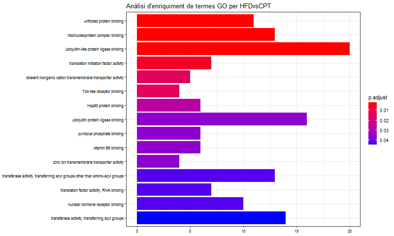
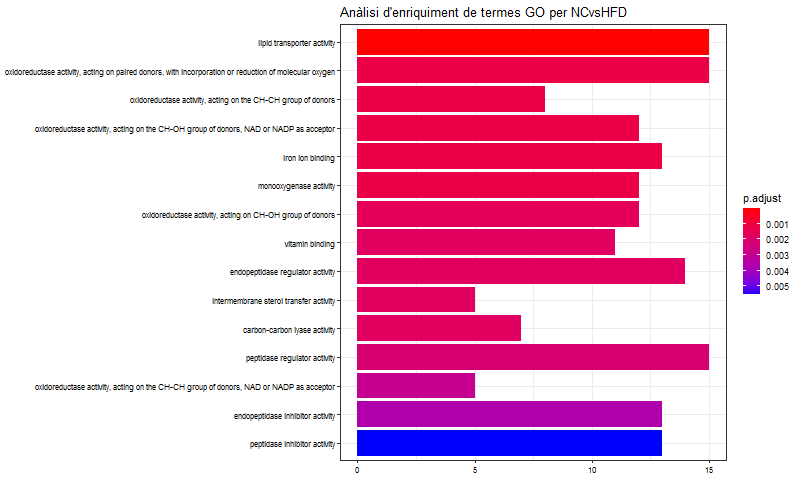
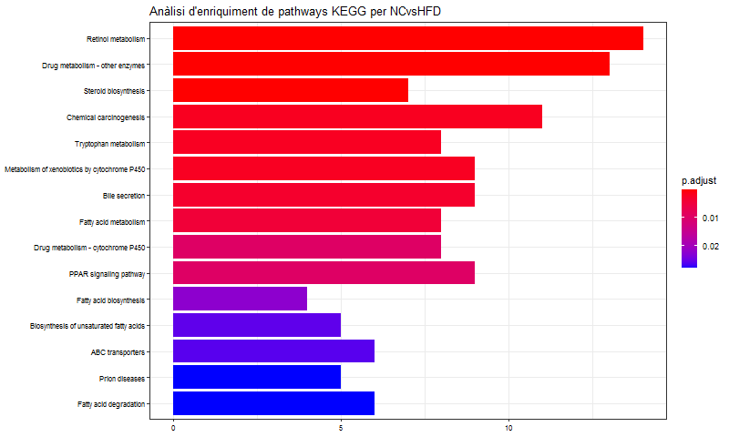
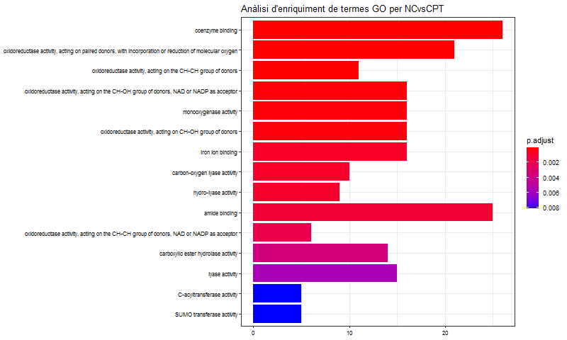
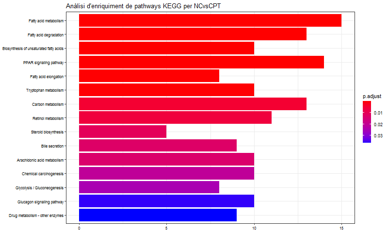

```{r setup, include=FALSE}
knitr::opts_chunk$set(echo = TRUE)
```

Codi utilitzat als apartats 3.2 i 4 de l'informe nualart_oriol_ADO_PEC1.pdf.


## CONTINGUTS

- **[3.2.1. Preparació de les dades](#preparació-de-les-dades)**
- **[3.2.2. Control de qualitat de les dades crues](#control-de-qualitat-de-les-dades-crues)**
- **[3.2.3. Normalització](#normalització)**
- **[3.2.4. Control de qualitat de les dades normalitzades](#control-de-qualitat-de-les-dades-normalitzades)**
- **[3.2.5. Filtratge no específic](#filtratge-no-específic)**
- **[3.2.6. Identificació de gens diferencialment expressats](#identificació-de-gens-diferencialment-expressats)**
- **[3.2.7. Anotació dels resultats](#anotació-dels-resultats)**
- **[3.2.8. Comparació entre comparacions](#comparació-entre-comparacions)**
- **[3.2.9. Anàlisi de significació biològica](#anàlisi-de-significació-biològica)**
- **[4. Resultats](#resultats)**

***

\newpage


### 3.2.1. Preparació de les dades

- Càrrega de l'arxiu targets.csv.

```{r}
targets <- read.csv2("./data/targets.csv", header = TRUE, sep = ";")
```

  
- Lectura dels arxius .CEL.  

```{r}
library(oligo)
celFiles <- list.celfiles("./data", full.names = TRUE)
library(Biobase)
my.targets <-read.AnnotatedDataFrame(file.path("./data","targets.csv"),
                                     header = TRUE, row.names = 1, 
                                     sep=";") 
rawData <- read.celfiles(celFiles, phenoData = my.targets)
```

  
- Canvi del nom llarg de les mostres pel *ShortName*.  

```{r}
my.targets@data$ShortName->rownames(pData(rawData))
colnames(rawData) <-rownames(pData(rawData))
```


### 3.2.2. Control de qualitat de les dades crues

- Controls de qualitat del paquet *arrayQualityMetrics*.  

```{r}
library(arrayQualityMetrics)
arrayQualityMetrics(rawData, intgroup = c("Diet", "ShortName"), outdir = "qcRaw",
                    force = TRUE)
```

  
- Visualització de la taula resum del control de qualitat i del heatmap. Nota: la imatge de la taula resum és una captura treta de l'informe de resultats.  

```{r, fig.show='hold', fig.align="center", out.width='0.4\\linewidth', fig.cap="Taula resum del control de qualitat de les dades crues i heatmap"}
library(knitr)
include_graphics(c("extra_pics/mdRaw.png", "qcRaw/hm.png"))
```

  
- Càrrega de les dades modificades.  

```{r}
targets <- read.csv2("./moddata/targets.csv", header = TRUE, sep = ";")

library(oligo)
celFiles <- list.celfiles("./moddata", full.names = TRUE)
library(Biobase)
my.targets <-read.AnnotatedDataFrame(file.path("./moddata","targets.csv"),
                                     header = TRUE, row.names = 1, 
                                     sep=";") 
rawData <- read.celfiles(celFiles, phenoData = my.targets)

my.targets@data$ShortName->rownames(pData(rawData))
colnames(rawData) <-rownames(pData(rawData))
```

  
- Repetició del control de qualitat.  

```{r}
arrayQualityMetrics(rawData, intgroup = c("Diet", "ShortName"), outdir = "qcMod",
                    force = TRUE)
```
  
- Visualització de la taula resum i el heatmap.  

```{r, fig.show='hold', fig.align="center", out.width='0.4\\linewidth', fig.cap="Taula resum del control de qualitat de les dades modificades i heatmap"}
include_graphics(c("extra_pics/mdMod.png", "qcMod/hm.png"))
```


### 3.2.3. Normalització

- Correcció del soroll de fons, normalització i sumarització de les dades.  

```{r}
library(oligo)
normData <- rma(rawData)
```


### 3.2.4. Control de qualitat de les dades normalitzades

  
```{r}
arrayQualityMetrics(normData, intgroup = c("Diet", "ShortName"), outdir = "qcNorm",
                    force = TRUE)
```
  
- Visualització de la taula resum i el heatmap.  

```{r, fig.show='hold', fig.align="center", out.width='0.4\\linewidth', fig.cap="Taula resum del control de qualitat de les dades normalitzades i heatmap"}
include_graphics(c("extra_pics/mdNorm.png", "qcNorm/hm.png"))
```

### 3.2.5. Filtratge no específic

- Filtratge dels gens menys variables.  

```{r}
library(genefilter)
library(mogene20sttranscriptcluster.db)
annotation(normData) <- "mogene20sttranscriptcluster.db"
filtered <- nsFilter(normData, 
                     require.entrez = TRUE, remove.dupEntrez = TRUE,
                     var.filter=TRUE, var.func=IQR, var.cutoff=0.5, 
                     filterByQuantile=TRUE, feature.exclude = "^AFFX")
filtData <- filtered$eset
```

  
- Visualització del número de gens descartats.  

```{r}
print(filtered$filter.log)
```

  
- Guardem les dades, un cop normalitzades i un cop filtrades, en arxius .csv.  

```{r}
write.csv(exprs(normData), file="./results/normData.csv")
write.csv(exprs(filtData), file="./results/filtData.csv")
```


### 3.2.6. Identificació de gens diferencialment expressats

- Matriu de disseny.  

```{r}
library(limma)
designMat<- model.matrix(~0+Diet, pData(filtData))
colnames(designMat) <- c("CPT", "HFD", "NC")
print(designMat)
```

  
- Matriu de contrastos.  

```{r}
contMat <- makeContrasts (HFDvsCPT = CPT-HFD,
                          NCvsHFD = HFD-NC,
                          NCvsCPT = CPT-NC,
                          levels=designMat)
print(contMat)
```

  
- Estimació del model.  

```{r}
library(limma)
fit<-lmFit(filtData, designMat)
```

  
- Estimació dels contrastos.  

```{r}
fit.main<-contrasts.fit(fit, contMat)
fit.main<-eBayes(fit.main)
```

  
- Guardem els resultats en un arxiu.  

```{r}
save(fit.main, file="./results/liver.fit.main.Rda")
```

  
- Exploració dels gens més diferencialment expressats en cada comparació.  

     HFD vs CPT:  

```{r}
top_HFDvsCPT <- topTable (fit.main, number=nrow(fit.main), coef="HFDvsCPT",
                               adjust="fdr") 
head(top_HFDvsCPT)
```

  
     NC vs HFD:  

```{r}
top_NCvsHFD <- topTable (fit.main, number=nrow(fit.main), coef="NCvsHFD", adjust="fdr") 
head(top_NCvsHFD)
```

  
     NC vs CPT:  

```{r}
top_NCvsCPT <- topTable (fit.main, number=nrow(fit.main), coef="NCvsCPT",
                               adjust="fdr") 
head(top_NCvsCPT)
```


### 3.2.7. Anotació dels resultats

- Funció *annotatedTopTable*.  

```{r}
annotatedTopTable <- function(topTab, anotPackage)
{
 topTab <- cbind(PROBEID=rownames(topTab), topTab)
 myProbes <- rownames(topTab)
 thePackage <- eval(parse(text = anotPackage))
 geneAnots <- select(thePackage, myProbes, c("SYMBOL", "ENTREZID", "GENENAME"))
 annotatedTopTab<- merge(x=geneAnots, y=topTab, by.x="PROBEID", by.y="PROBEID")
return(annotatedTopTab)
}
```


- Generació de les anotacions.  

```{r}
library(mogene20sttranscriptcluster.db)

annot_HFDvsCPT <- annotatedTopTable(top_HFDvsCPT,
                                    anotPackage="mogene20sttranscriptcluster.db")
annot_NCvsHFD <- annotatedTopTable(top_NCvsHFD,
                                   anotPackage="mogene20sttranscriptcluster.db")
annot_NCvsCPT <- annotatedTopTable(top_NCvsCPT,
                                   anotPackage="mogene20sttranscriptcluster.db")
```
  
- Guardem els *data frames* obtinguts en arxius .csv.  

```{r}
write.csv(annot_HFDvsCPT, file="./results/annot_HFDvsCPT.csv")
write.csv(annot_NCvsHFD, file="./results/annot_NCvsHFD.csv")
write.csv(annot_NCvsCPT, file="./results/annot_NCvsCPT.csv")
```

  
- Volcano plots.  

```{r}
geneNames <- select(mogene20sttranscriptcluster.db, rownames(fit.main), c("GENENAME"))
geneNames <- geneNames$GENENAME
opt <- par(cex.lab = 0.7)
```
  
     HFD vs CPT:  

```{r, echo = FALSE, message=FALSE, fig.show='hold', fig.align="center", out.width='0.7\\linewidth'}
volcanoplot(fit.main, coef=1, highlight=10, names=geneNames,
main=paste("Gens diferencialment expressats en el contrast",
colnames(contMat)[1], sep="\n"))
abline(v=c(-1,1))
par(opt)
```

  
     NC vs HFD:  

```{r, echo = FALSE, message=FALSE, fig.show='hold', fig.align="center", out.width='0.7\\linewidth'}
volcanoplot(fit.main, coef=2, highlight=10, names=geneNames,
main=paste("Gens diferencialment expressats en el contrast",
colnames(contMat)[2], sep="\n"))
abline(v=c(-1,1))
par(opt)
```

  
     NC vs CPT:  

```{r, echo = FALSE, message=FALSE, fig.show='hold', fig.align="center", out.width='0.7\\linewidth'}
volcanoplot(fit.main, coef=3, highlight=10, names=geneNames,
main=paste("Gens diferencialment expressats en el contrast",
colnames(contMat)[3], sep="\n"))
abline(v=c(-1,1))
par(opt)
```

  
- Selecció dels gens diferencialment expressats.  

```{r}
library(limma)
res <- decideTests(fit.main, method="separate", adjust.method="fdr", p.value=0.1, lfc=0.75)
sum.res.rows <- apply(abs(res), 1, sum)
res.selected <- res[sum.res.rows!=0,]
```

  
- *Heatmap*  

```{r}
library(gplots)

genesHeatmap <- rownames(res.selected)
heatData <- exprs(filtData)[rownames(exprs(filtData)) %in% genesHeatmap,]
geneNames <- select(mogene20sttranscriptcluster.db, rownames(heatData), c("GENENAME"))
GENENAMES<- geneNames$GENENAME
rownames(heatData) <- GENENAMES
my_palette <- colorRampPalette(c("blue3", "gold"))(n = 299)
```

```{r}
heatmap.2(heatData,
          Rowv = TRUE,
          Colv = TRUE,
          dendrogram = "column",
          main = "Gens diferencialment expressats \n FDR < 0,1, logFC >=0.75",
          scale = "row",
          col = my_palette,
          sepcolor = "white",
          sepwidth = c(0.05,0.05),
          cexRow = 0.5,
          cexCol = 0.9,
          key = FALSE,
          density.info = "histogram",
          ColSideColors = c(rep("firebrick2",4), rep("dodgerblue3",5),
                            rep("limegreen",5)),
          tracecol = NULL,
          srtCol = 30)
```


### 3.2.8. Comparació entre comparacions

- Número de gens diferencialment expressats en cada comparació.  

```{r}
print(summary(res))
```

  
- Diagrama de Venn.  

```{r}
vennDiagram (res.selected[,1:3], cex=0.9)
title("Gens diferencialment expressats segons cada comparació.")
```


### 3.2.9. Anàlisi de significació biològica

- Generació dels llistats d'identificadors *Entrez*.  

```{r}
genesHFDvsCPT <- top_HFDvsCPT["adj.P.Val"]<0.25
IDsHFDvsCPT <- rownames(top_HFDvsCPT)[genesHFDvsCPT]
EntrezHFDvsCPT <- select(mogene20sttranscriptcluster.db, IDsHFDvsCPT, c("ENTREZID"))
EntrezHFDvsCPT <- EntrezHFDvsCPT$ENTREZID

genesNCvsHFD <- top_NCvsHFD["adj.P.Val"]<0.25
IDsNCvsHFD <- rownames(top_NCvsHFD)[genesNCvsHFD]
EntrezNCvsHFD <- select(mogene20sttranscriptcluster.db, IDsNCvsHFD, c("ENTREZID"))
EntrezNCvsHFD <- EntrezNCvsHFD$ENTREZID

genesNCvsCPT <- top_NCvsCPT["adj.P.Val"]<0.25
IDsNCvsCPT <- rownames(top_NCvsCPT)[genesNCvsCPT]
EntrezNCvsCPT <- select(mogene20sttranscriptcluster.db, IDsNCvsCPT, c("ENTREZID"))
EntrezNCvsCPT <- EntrezNCvsCPT$ENTREZID

selectedIDs <- list(EntrezHFDvsCPT, EntrezNCvsHFD, EntrezNCvsCPT)
names(selectedIDs) <- c("HFDvsCPT", "NCvsHFD", "NCvsCPT")
```

  
- Número de gens inclosos en cada llistat.  

```{r}
sapply(selectedIDs, length)
```

  
- Genergeneració del llistat dels gens de ratolí amb anotacions a GO i a KEGG.  

```{r}
library(org.Mm.eg.db)
mapped_genes2GO <- mappedkeys(org.Mm.egGO)
mapped_genes2KEGG <- mappedkeys(org.Mm.egPATH)
mapped_genes <- union(mapped_genes2GO , mapped_genes2KEGG)
```

  
- Anàlisi d'enriquiment de termes GO.  

```{r}
library(clusterProfiler)
listOfData <- selectedIDs[1:3]
comparisonsNames <- names(listOfData)

for (i in 1:length(listOfData)){
        genesIn <- listOfData[[i]]
        comparison <- comparisonsNames[i]
        
        enrich.GO <- enrichGO(gene = genesIn,
                              OrgDb = org.Mm.eg.db,
                              pvalueCutoff = 0.05,
                              pAdjustMethod = "BH",
                              universe = mapped_genes)
        
        if (length(rownames(enrich.GO@result)) != 0) {
                write.csv(as.data.frame(enrich.GO), 
                          file = paste0("./results/", "enrichGO.Results.", comparison,
                                        ".csv"),
                          row.names = FALSE)
                
                png(file=paste0("./results/","enrichGOBarplot.",comparison,".png"),
                    width = 800)
                print(barplot(enrich.GO, showCategory = 15, font.size = 8, 
                              title = paste0("Anàlisi d'enriquiment de termes GO per ",
                                             comparison)))
                dev.off()
                
                png(file = paste0("./results/","enrichGOcnetplot.",comparison,".png"))
                print(cnetplot(enrich.GO, categorySize = "geneNum",
                               schowCategory = 15, vertex.label.cex = 0.75))
                dev.off()
        }
}
```

  
- Anàlisi d'enriquiment de *pathways* KEGG.  

```{r}
for (i in 1:length(listOfData)){
        genesIn <- listOfData[[i]]
        comparison <- comparisonsNames[i]
        
        enrich.KEGG <- enrichKEGG(gene = genesIn,
                                  organism     = 'mmu',
                                  pvalueCutoff = 0.1,
                                  pAdjustMethod = "BH",
                                  universe = mapped_genes)

        
        if (length(rownames(enrich.KEGG@result)) != 0) {
                write.csv(as.data.frame(enrich.KEGG), 
                          file = paste0("./results/", "enrichKEGG.Results.", comparison,
                                        ".csv"),
                          row.names = FALSE)
                
                png(file=paste0("./results/","enrichKEGGBarplot.",comparison,".png"),
                    width = 800)
                print(barplot(enrich.KEGG, showCategory = 15, font.size = 8, 
                              title = paste0("Anàlisi d'enriquiment de pathways KEGG per ", comparison)))
                dev.off()
                
                png(file = paste0("./results/","enrichKEGGcnetplot.",comparison,".png"))
                print(cnetplot(enrich.KEGG, categorySize = "geneNum",
                               schowCategory = 15, vertex.label.cex = 0.75))
                dev.off()
        }
}
```


### 4. Resultats

- Imatges dels gràfics de resultats.  

```{r, fig.show='hold', fig.align="center", out.width='0.8\\linewidth', fig.cap="Gràfic de barres de termes GO per HFD vs CPT"}
library(knitr)

```

```{r, fig.show='hold', fig.align="center", out.width='0.8\\linewidth', fig.cap="Gràfic de barres de pathways per HFD vs CPT"}
include_graphics("results/enrichKEGGBarplot.HFDvsCPT.png")
```


```{r, fig.show='hold', fig.align="center", out.width='0.4\\linewidth', fig.cap="Gràfics de ret de termes GO i de pathways per HFD vs CPT"}
include_graphics(c("results/enrichGOcnetplot.HFDvsCPT.png",
                   "results/enrichKEGGcnetplot.HFDvsCPT.png"))
```

```{r, fig.show='hold', fig.align="center", out.width='0.8\\linewidth', fig.cap="Gràfic de barres de termes GO per NC vs HFD"}

```

```{r, fig.show='hold', fig.align="center", out.width='0.8\\linewidth', fig.cap="Gràfic de barres de pathways per NC vs HFD"}

```


```{r, fig.show='hold', fig.align="center", out.width='0.4\\linewidth', fig.cap="Gràfics de ret de termes GO i de pathways per NC vs HFD"}
include_graphics(c("results/enrichGOcnetplot.NCvsHFD.png",
                   "results/enrichKEGGcnetplot.NCvsHFD.png"))
```

```{r, fig.show='hold', fig.align="center", out.width='0.8\\linewidth', fig.cap="Gràfic de barres de termes GO per NC vs CPT"}

```


```{r, fig.show='hold', fig.align="center", out.width='0.8\\linewidth', fig.cap="Gràfic de barres de pathways per NC vs CPT"}

```

```{r, fig.show='hold', fig.align="center", out.width='0.4\\linewidth', fig.cap="Gràfics de ret de termes GO i de pathways per NC vs CPT"}
include_graphics(c("results/enrichGOcnetplot.NCvsCPT.png",
                   "results/enrichKEGGcnetplot.NCvsCPT.png"))
```
